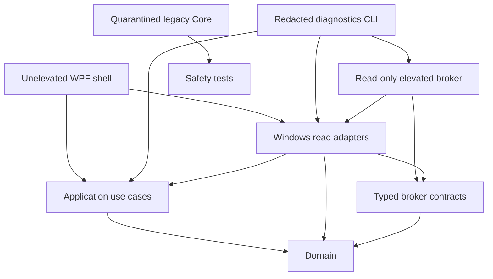
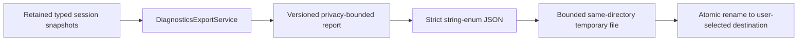
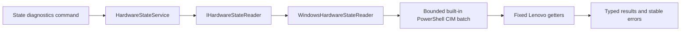
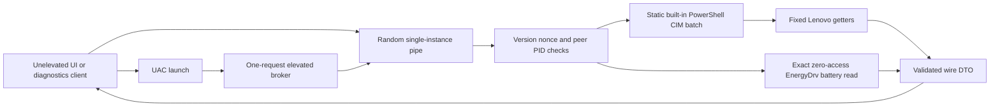
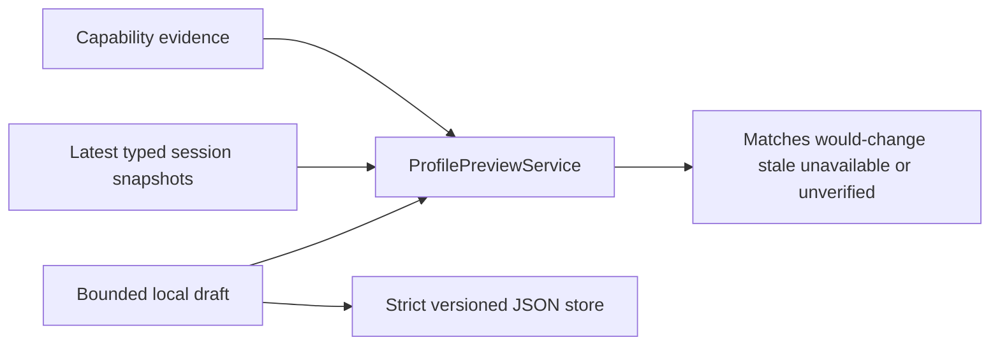
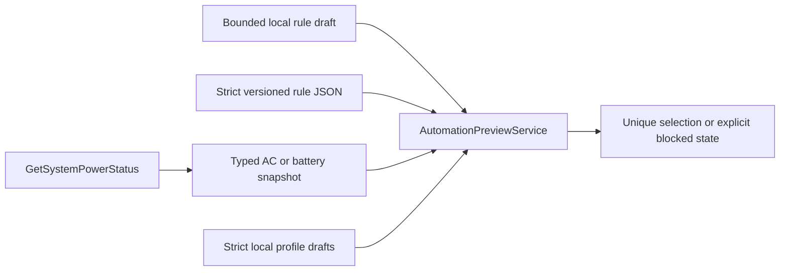

# Architecture

## Current dependency graph

The WPF project does not reference `LegionLoqControl.Core`. That assembly contains the
pre-rebuild WMI, IOCTL, and HID writers and remains locked by `HardwareWritePolicy` while
its behavior is replaced feature by feature.

## Projects

- `src/LegionLoqControl.Domain`: platform-neutral observations, capability evidence,
  hardware read results, hardware states, bounded profile and automation drafts, and
  preview outcomes.
- `src/LegionLoqControl.Application`: read-only use cases and ports such as
  `IMachineIdentitySource`, `ICapabilityProbe`, `IHardwareStateReader`, `IProfileStore`,
  `IPowerSourceReader`, `IAutomationRuleStore`, and `IDiagnosticsExportWriter`.
- `src/LegionLoqControl.Infrastructure.Windows`: Windows WMI inventory and strict read
  adapters plus bounded local JSON profile, automation, and diagnostics writers. Inventory
  does not invoke methods; the state adapter invokes only fixed Lenovo getters and never
  exposes WMI names to callers.
- `src/LegionLoqControl.Contracts`: versioned, typed compare-and-set commands for the
  future write path plus the bounded read-only wire protocol. Raw IOCTL values, WMI names,
  and HID packets are not IPC contracts.
- `src/LegionLoqControl.Broker`: short-lived `requireAdministrator` process that serves one
  authenticated, typed hardware-state read or one allowlisted write and exits.
- `src/LegionLoqControl.Diagnostics`: versioned serial-free JSON report, direct state probe,
  and explicit brokered state-validation client.
- `LegionLoqControl`: unelevated WPF composition root, precision dashboard, and local
  diagnostics export, profile, and automation-preview workspaces.
- `LegionLoqControl.Core`: quarantined migration prototype; never reference it from new
  product projects.

## Inventory flow

1. The composition root creates `MachineDiagnosticsService`.
2. `WindowsMachineIdentitySource` reads an allowlist of non-sensitive CIM properties.
3. `WindowsCapabilityProbe` inventories class method names and matching HID product IDs.
4. Every probe emits evidence. Interface presence remains `Unknown`, not `Supported`.
5. Probe failures become typed unknown evidence with stable error codes.
6. `DiagnosticsExportService` maps the snapshot into an explicit, versioned allowlist.
7. The CLI serializes that report without serial numbers, device paths, usernames,
   exception details, local drafts, or reflection-discovered fields.

Metadata is cached per scan so each WMI class and HID vendor inventory is queried once.

## Diagnostics export flow

The dashboard export view model depends on the retained session and export writer, not the
dashboard data source or broker client. Export therefore cannot trigger a new hardware
read, UAC prompt, profile-store read, or hardware write. Hardware state is marked
`notCaptured` until an explicit brokered read has already succeeded.

The report DTO is an allowlist rather than a serialized domain graph. Observation details,
dynamic source strings, profile and rule data, transport identifiers, and future domain
properties stay out unless the export contract is deliberately versioned. Output is capped
at 256 KiB, written with exclusive access and write-through, flushed to disk, and renamed
within the destination directory. Cancellation before rename preserves the previous file.

## Hardware state read flow

Reads are serialized and one batch is cached per snapshot. The adapter validates the
Boolean WMI return status and UInt32 data, rejects unknown enum values, caps output at
64 KiB, and applies a 12-second child-process bound. Access denial, unsupported transport,
malformed output, and timeout remain distinct from real hardware values.

On the recorded 83DV machine, the Lenovo WMI getters require elevation. The CLI can expose
the unelevated denial, while the CLI and WPF dashboard can explicitly launch the broker
through UAC. The dashboard never elevates at startup; refresh and apply are direct user
actions. Battery mode remains unavailable in the unelevated reader; the broker adds one
exact zero-access EnergyDrv read and, on `--write`, one typed EnergyDrv battery write.

## Current brokered read flow

The unelevated process owns the pipe so the high-integrity broker writes down to a
medium-integrity object. Its DACL grants only the initiating user SID. Both ends verify the
other process ID, the request includes a 256-bit one-time nonce, the elevated client uses
anonymous impersonation, and the frame is strict JSON capped at 64 KiB. The broker accepts
one request and has a 30-second lifetime.

.NET's `PipeOptions.CurrentUserOnly` is not used because it also enforces equal elevation
levels, which would reject this split-token connection. Before launch, the client assesses
the sibling path: development mode may use an unsigned user-writable copy, while
production mode requires an administrator-owned directory and an Authenticode signature.
See [`BROKER_INSTALL.md`](BROKER_INSTALL.md).

## Profile preview flow

Creating, editing, saving, deleting, and previewing a profile stays in the unelevated
process. The store is capped, rejects unknown JSON members and numeric enum values, takes
an exclusive same-directory lock across process instances, and replaces its file
atomically. Previewing compares domain values directly; it never parses
display text. The profile workspace has no broker reference, Apply command, or automation
runner.

## Automation preview flow

Rule evaluation is deterministic and platform-neutral. Only enabled rules matching the
fresh observed source participate; exactly one unique highest priority must win. Duplicate
IDs, equal winning priorities, stale or unavailable observations, no match, and missing
profiles are explicit blocked outcomes. The Windows adapter performs one local power-status
read. No polling loop, background watcher, scheduler, broker call, or profile application
exists.

## Desktop rendering policy

The current low-motion WPF shell uses software rendering. This avoids blank client surfaces
observed with the hardware-composition path on the validated Windows build and keeps visual
behavior deterministic while that path is qualified. Rendering policy does not alter the
hardware access boundary.

## Future privileged flow

```mermaid
flowchart LR
    Client[Unelevated UI or CLI] --> Request[Typed read or write request]
    Request --> Broker[Short-lived elevated broker]
    Broker --> Validate[Identity and capability validation]
    Validate --> Compare[Fresh read and expected-state compare]
    Compare --> Operation[Bounded hardware operation]
    Operation --> Verify[Readback verification for writes]
    Verify --> Result[Typed result and redacted journal]
```

The current broker accepts one typed read or one allowlisted write per launch. Remaining
write-path work includes executable signing and installation ACLs, machine-wide locking,
journaling, and crash reconciliation.

## Architectural rules

- Domain and Application projects stay platform-neutral.
- Infrastructure may depend inward; Domain never depends on Windows or transport code.
- UI and CLI compose interfaces but do not contain hardware protocols.
- Unknown and failure are first-class states, never `false`, zero, or an arbitrary mode.
- Read adapters use fixed identifiers; user-controlled WMI queries are forbidden.
- New dependencies use central package versions and committed lock files.
- A capability becomes `Supported` only with provenance, fixtures, and exact model/BIOS
  hardware evidence.
