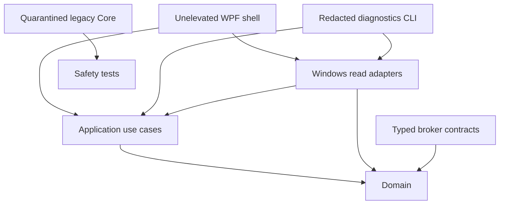
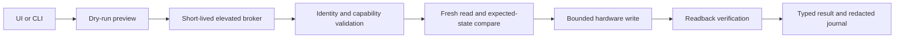

# Architecture

## Current dependency graph

The WPF project does not reference `LegionLoqControl.Core`. That assembly contains the
pre-rebuild WMI, IOCTL, and HID writers and remains locked by `HardwareWritePolicy` while
its behavior is replaced feature by feature.

## Projects

- `src/LegionLoqControl.Domain`: platform-neutral observations, capability evidence,
  hardware states, and bounded value objects.
- `src/LegionLoqControl.Application`: read-only use cases and ports such as
  `IMachineIdentitySource` and `ICapabilityProbe`.
- `src/LegionLoqControl.Infrastructure.Windows`: Windows WMI metadata and HID inventory
  adapters. It does not invoke Lenovo WMI methods or open HID devices during diagnostics.
- `src/LegionLoqControl.Contracts`: versioned, typed compare-and-set commands for the
  future broker. Raw IOCTL values, WMI names, and HID packets are not IPC contracts.
- `src/LegionLoqControl.Diagnostics`: serial-free JSON evidence collector.
- `LegionLoqControl`: unelevated WPF composition root and read-only status UI.
- `LegionLoqControl.Core`: quarantined migration prototype; never reference it from new
  product projects.

## Read-only diagnostics flow

1. The composition root creates `MachineDiagnosticsService`.
2. `WindowsMachineIdentitySource` reads an allowlist of non-sensitive CIM properties.
3. `WindowsCapabilityProbe` inventories class method names and matching HID product IDs.
4. Every probe emits evidence. Interface presence remains `Unknown`, not `Supported`.
5. Probe failures become typed unknown evidence with stable error codes.
6. The CLI serializes the snapshot without serial numbers, device paths, usernames, or
   exception messages.

Metadata is cached per scan so each WMI class and HID vendor inventory is queried once.

## Future write flow

The broker does not exist yet. Hardware writes remain disabled until this entire path,
including ACLs, serialization, timeouts, machine-wide locking, and crash reconciliation,
is implemented and reviewed.

## Architectural rules

- Domain and Application projects stay platform-neutral.
- Infrastructure may depend inward; Domain never depends on Windows or transport code.
- UI and CLI compose interfaces but do not contain hardware protocols.
- Unknown and failure are first-class states, never `false`, zero, or an arbitrary mode.
- Read adapters use fixed identifiers; user-controlled WMI queries are forbidden.
- New dependencies use central package versions and committed lock files.
- A capability becomes `Supported` only with provenance, fixtures, and exact model/BIOS
  hardware evidence.
