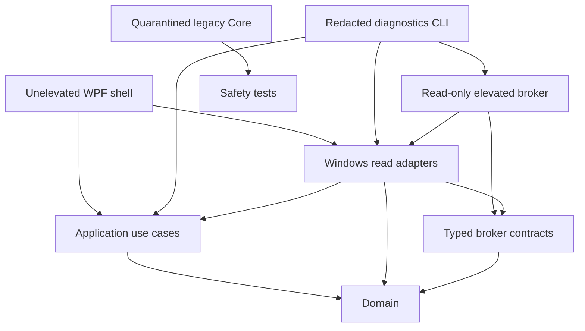
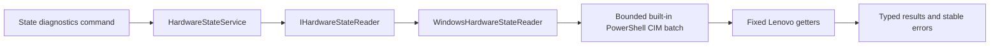
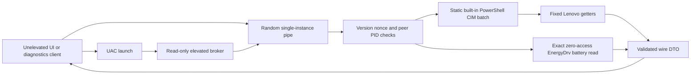
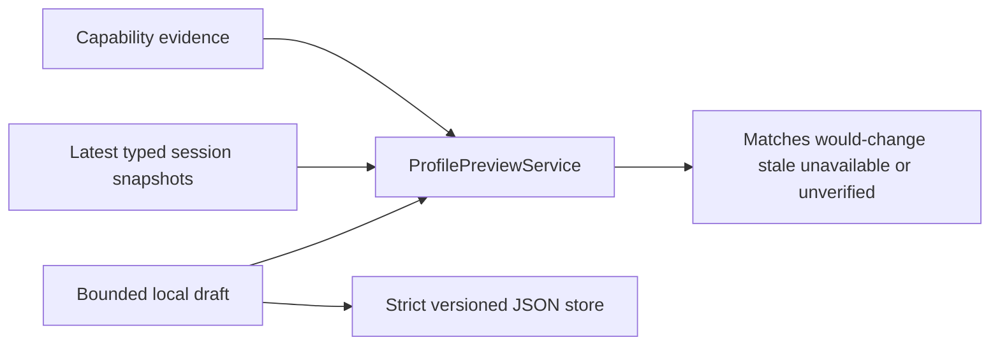

# Architecture

## Current dependency graph

The WPF project does not reference `LegionLoqControl.Core`. That assembly contains the
pre-rebuild WMI, IOCTL, and HID writers and remains locked by `HardwareWritePolicy` while
its behavior is replaced feature by feature.

## Projects

- `src/LegionLoqControl.Domain`: platform-neutral observations, capability evidence,
  hardware read results, hardware states, bounded profile drafts, and preview outcomes.
- `src/LegionLoqControl.Application`: read-only use cases and ports such as
  `IMachineIdentitySource`, `ICapabilityProbe`, `IHardwareStateReader`, and `IProfileStore`.
- `src/LegionLoqControl.Infrastructure.Windows`: Windows WMI inventory and strict read
  adapters plus the bounded local JSON profile store. Inventory does not invoke methods;
  the state adapter invokes only fixed Lenovo getters and never exposes WMI names to callers.
- `src/LegionLoqControl.Contracts`: versioned, typed compare-and-set commands for the
  future write path plus the bounded read-only wire protocol. Raw IOCTL values, WMI names,
  and HID packets are not IPC contracts.
- `src/LegionLoqControl.Broker`: short-lived `requireAdministrator` process that serves one
  authenticated, typed hardware-state read and exits. It contains no write dispatcher.
- `src/LegionLoqControl.Diagnostics`: serial-free JSON inventory, direct state probe, and
  explicit brokered state-validation client.
- `LegionLoqControl`: unelevated WPF composition root, precision dashboard, and local
  profile-preview workspace.
- `LegionLoqControl.Core`: quarantined migration prototype; never reference it from new
  product projects.

## Inventory flow

1. The composition root creates `MachineDiagnosticsService`.
2. `WindowsMachineIdentitySource` reads an allowlist of non-sensitive CIM properties.
3. `WindowsCapabilityProbe` inventories class method names and matching HID product IDs.
4. Every probe emits evidence. Interface presence remains `Unknown`, not `Supported`.
5. Probe failures become typed unknown evidence with stable error codes.
6. The CLI serializes the snapshot without serial numbers, device paths, usernames, or
   exception messages.

Metadata is cached per scan so each WMI class and HID vendor inventory is queried once.

## Hardware state read flow

Reads are serialized and one batch is cached per snapshot. The adapter validates the
Boolean WMI return status and UInt32 data, rejects unknown enum values, caps output at
64 KiB, and applies a 12-second child-process bound. Access denial, unsupported transport,
malformed output, and timeout remain distinct from real hardware values.

On the recorded 83DV machine, the Lenovo WMI getters require elevation. The CLI can expose
the unelevated denial, while the CLI and WPF dashboard can explicitly launch the read-only
broker through UAC. The dashboard never elevates at startup; its hardware-state refresh is
a direct user action. Battery mode remains unavailable in the unelevated reader; the broker
adds one exact zero-access EnergyDrv read.

## Current brokered read flow

The unelevated process owns the pipe so the high-integrity broker writes down to a
medium-integrity object. Its DACL grants only the initiating user SID. Both ends verify the
other process ID, the request includes a 256-bit one-time nonce, the elevated client uses
anonymous impersonation, and the frame is strict JSON capped at 64 KiB. The broker accepts
one request and has a 30-second lifetime.

.NET's `PipeOptions.CurrentUserOnly` is not used because it also enforces equal elevation
levels, which would reject this split-token connection. Production use still requires a
signed broker and administrator-protected installation directory.

## Profile preview flow

Creating, editing, saving, deleting, and previewing a profile stays in the unelevated
process. The store is capped, rejects unknown JSON members and numeric enum values, and
replaces its file atomically. Previewing compares domain values directly; it never parses
display text. The profile workspace has no broker reference, Apply command, or automation
runner.

## Future privileged flow

The current broker accepts reads only. Hardware writes remain disabled until write-specific
authorization, executable signing and installation ACLs, capability validation,
machine-wide locking, readback, journaling, and crash reconciliation are implemented and
reviewed.

## Architectural rules

- Domain and Application projects stay platform-neutral.
- Infrastructure may depend inward; Domain never depends on Windows or transport code.
- UI and CLI compose interfaces but do not contain hardware protocols.
- Unknown and failure are first-class states, never `false`, zero, or an arbitrary mode.
- Read adapters use fixed identifiers; user-controlled WMI queries are forbidden.
- New dependencies use central package versions and committed lock files.
- A capability becomes `Supported` only with provenance, fixtures, and exact model/BIOS
  hardware evidence.
